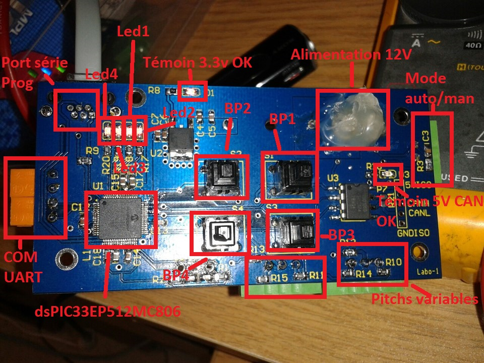

Fanard
=====

CommandeMoteur: control motor of chinook 3

Part of: [Chinook](http://chinook.etsmtl.ca) wind-powered vehicule. 

Description
-----------

  
Features
--------

* Input voltage : 12V (caution, don't use usb connection (UART) if input voltage 12v is connected)
* MCU   	: dsPIC33EP512MC806
* Datalogging 	: N/A
* RealTimeClock	: N/A
* EEPROM 	: N/A
* Accelerometer : N/A
* DAQ		: N/A
* Communication :
  * CANBUS 	: iso1050
  * Serial TTL 	: FT232RL
  * RS232	: N/A
  * RS485	: N/A
  * UART 	: ...

Pins mapping
------------

* Led1 : P96/RF0
* Led2 : RP97/RF1R
* Led3 : AN24/PWM1L/PMD0/RP80/RE0
* Led4 : AN26/PWM2L/PMD2/RP82/RE2
* BP1 : INT0/RP64/RD0
* BP2 : PGEC2/SOSCO/C3IN1-/T1CK/RPI62/RC14
* BP3 : ASCL1/PMCS2/RPI74/RD10
* BP4 : RTCC/RPI72/RD8

Known Bugs
----------

* Opamp supply are inverted
* EEPROM SDA and SCL are inverted
* RTC xtal won't start 
