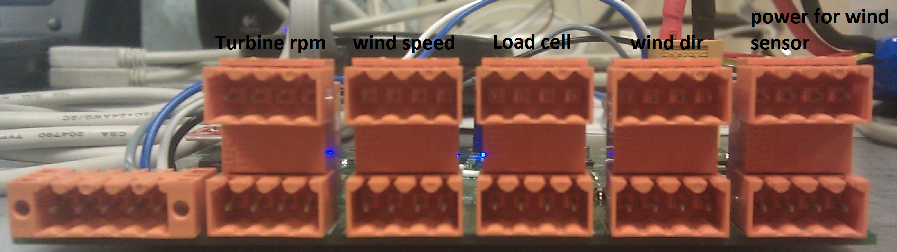

BTV1
=====

BTV1: Benchtest for Chinook 3 
  
Features
--------

* Get Data from usb/serial port of the sensor's board.
* Samplig rate : 10Hz
* Data in terminal : Timestamp(s)   Trust(lbs)   Wind direction(degres)   Wind speed(m/s)   Turbine speed(RPM)

Board Connections
-----------------

Terminal Configuration
----------------------

* 115200 Baud
* 8 bits with no parity
* 1 stop bit

To Do
-----

* Update the UART lib to the last version
* Put a faster sampling rate for the data : 20Hz or 40Hz
